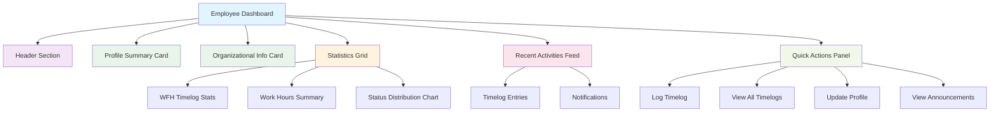

# Comprehensive Employee Dashboard Plan

## Overview

The existing employee dashboard primarily displays Work From Home (WFH) timelog statistics and recent entries. This plan outlines the design for a more comprehensive dashboard that includes personal profile information, organizational details, enhanced activities tracking, and quick action features. The design ensures complementarity with existing admin functions without overlap.

## Current State Analysis

- **Existing Components**:
    - WFH timelog statistics: total, pending, approved, rejected, and current month counts
    - Recent 5 timelogs display
- **Data Sources**: Primarily `WfhTimelog` model
- **UI**: Simple Livewire component with basic cards
- **Limitations**: Focused solely on timelogs; lacks personal and organizational context

## Proposed Components

### 1. Personal Profile Summary Card

- **Purpose**: Provide quick access to employee's personal information
- **Content**:
    - Profile image (if available)
    - Full name with suffix
    - Employee number (formatted)
    - Position title
    - Contact information (email, phone)
    - Employment status
- **Interactions**: Click to view/edit profile (link to profile page)

### 2. Organizational Information Card

- **Purpose**: Display office and unit assignment details
- **Content**:
    - Office name and code
    - Unit name and code
    - Position details (including component if applicable)
    - Date hired
    - Employment status
- **Interactions**: Links to office/unit directories if available

### 3. Work Statistics Dashboard

- **Purpose**: Comprehensive work-related metrics
- **Content**:
    - Existing WFH timelog stats
    - Additional metrics: average daily hours, completion rate, trends
    - Visual charts (bar/pie charts for status distribution)
- **Data**: Extended from current timelog queries

### 4. Recent Activities Feed

- **Purpose**: Timeline of recent work activities and system events
- **Content**:
    - Recent timelogs with status indicators
    - Approval/rejection notifications
    - System announcements (if implemented)
    - Activity timestamps
- **Limit**: Last 10-15 items for performance

### 5. Quick Actions Panel

- **Purpose**: Provide shortcuts to common employee tasks
- **Actions**:
    - Log new WFH timelog
    - View all timelogs (link to MyTimelogs)
    - Update profile information
    - View announcements/notifications
    - Request leave (if implemented)
- **UI**: Button grid or action cards

### 6. Notifications/Announcements Widget

- **Purpose**: Keep employees informed of important updates
- **Content**:
    - System-wide announcements
    - Personal notifications (approvals, rejections)
    - Upcoming events/deadlines
- **Optional**: Can be implemented in future phases

## Data Sources

### Primary Models

- **Employee**: Personal details, organizational assignments, employment info
- **User**: Authentication status, roles, login history
- **WfhTimelog**: Work activity logs and status

### Related Models

- **Office**: Office names and codes
- **Unit**: Unit names and codes
- **Position**: Position titles and components

### Data Relationships

```
User (employee_number) -> Employee (employee_number)
Employee -> Office (office_id)
Employee -> Unit (unit_id)
Employee -> Position (position_id)
User -> WfhTimelog (user_id)
```

## UI Structure

### Layout Overview

- **Framework**: Flux UI components within Livewire
- **Grid System**: Responsive grid layout (3-4 columns on desktop, stacked on mobile)
- **Color Scheme**: Consistent with existing app theme
- **Accessibility**: Proper ARIA labels and keyboard navigation

### Component Hierarchy

```
Dashboard Layout
├── Header (Welcome message, date)
├── Profile Summary Card
├── Organizational Info Card
├── Statistics Cards Grid
│   ├── WFH Stats
│   ├── Additional Metrics
├── Recent Activities Feed
└── Quick Actions Panel
```

### Mermaid Diagram for UI Layout



### Responsive Breakpoints

- **Desktop (>1024px)**: 4-column grid
- **Tablet (768-1024px)**: 2-column grid
- **Mobile (<768px)**: Single column stack

### Component Specifications

- **Cards**: Flux card components with consistent padding and shadows
- **Buttons**: Flux button variants (primary, secondary, outline)
- **Icons**: Heroicons via Flux icon components
- **Charts**: Simple CSS-based charts or integration with Chart.js if needed

## Implementation Considerations

### Performance

- **Caching**: Cache organizational data (offices, units, positions)
- **Pagination**: Limit recent activities to prevent large queries
- **Lazy Loading**: Load heavy components (charts) asynchronously

### Security

- **Authorization**: Ensure all data queries respect user permissions
- **Data Filtering**: Only show employee's own data and public info

### Extensibility

- **Modular Design**: Each component can be developed independently
- **Configurable**: Admin-configurable dashboard components
- **API Ready**: Structure for future API integration

### Testing

- **Unit Tests**: Test data fetching methods
- **Integration Tests**: Test component rendering and interactions
- **User Acceptance**: Validate with sample employee data

## Implementation Steps

1. Analyze current Dashboard component and view
2. Extend Dashboard.php with new data fetching methods
3. Update dashboard.blade.php view with new components
4. Create reusable sub-components if needed
5. Add styling and responsive design
6. Test functionality and performance
7. Document new features and update user guides

## Dependencies

- Existing: Employee, User, WfhTimelog models
- New: Potential for Announcement model if notifications implemented
- UI: Flux UI components (already in use)

## Risk Assessment

- **Data Privacy**: Ensure no sensitive information leakage
- **Performance Impact**: Monitor query performance with additional data
- **UI Consistency**: Maintain design consistency with existing admin dashboards

This plan provides a comprehensive foundation for enhancing the employee dashboard while maintaining compatibility with the existing HRMS architecture.
